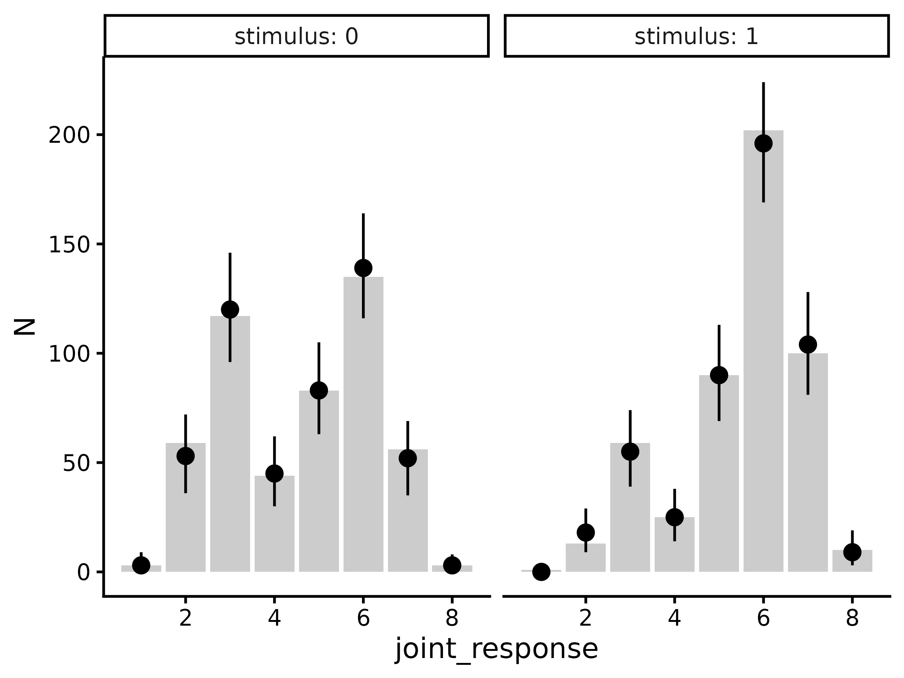
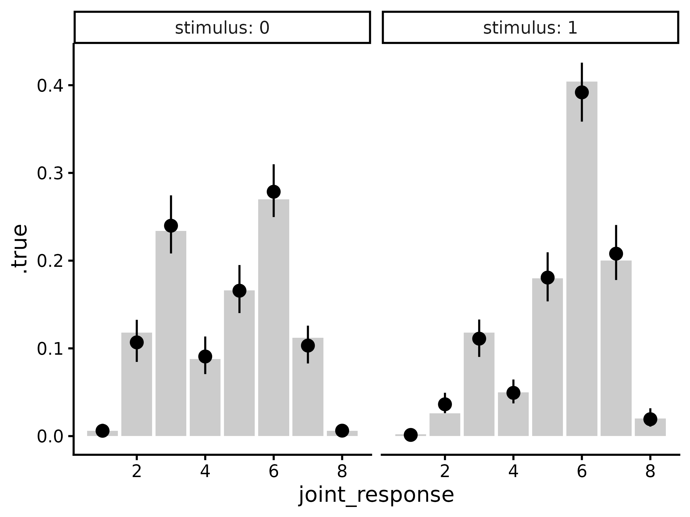
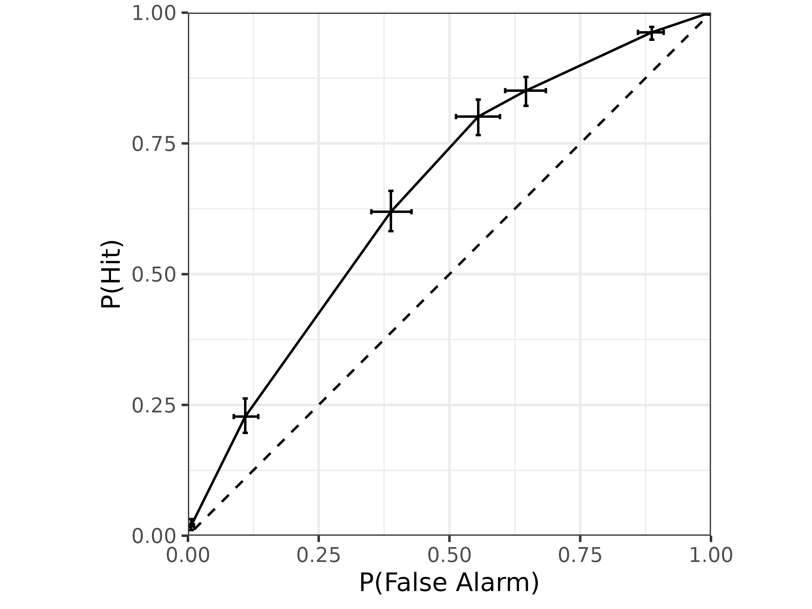
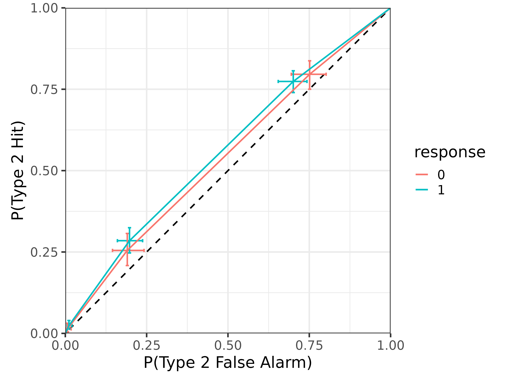

# Fitting the meta-d' model

## Introduction

This vignette demonstrates how to use the `mRatio` package to fit the
meta-d’ model (Maniscalco & Lau, 2012) to a dataset including a binary
decision with confidence ratings.

## Data preparation

To get a better idea of what kind of datasets the `mRatio` package is
designed for, we can start by simulating one (see
[`help('sim_metad')`](https://metacoglab.github.io/mRatio/reference/sim_metad.md)
for a description of the data simulation function):

``` r
library(tidyverse)
library(brms)
library(tidybayes)
library(mRatio)

d <- sim_metad(
  N_trials = 1000, dprime = .75, c = -.5, log_M = -1,
  c2_0 = c(.25, .75, 1), c2_1 = c(.5, 1, 1.25)
)
```

    #> # A tibble: 1,000 × 4
    #> # Groups:   stimulus, response, confidence [16]
    #>    trial stimulus response confidence
    #>    <int>    <int>    <int>      <int>
    #>  1     1        0        0          1
    #>  2     2        0        0          1
    #>  3     3        0        0          1
    #>  4     4        0        0          1
    #>  5     5        0        0          1
    #>  6     6        0        0          1
    #>  7     7        0        0          1
    #>  8     8        0        0          1
    #>  9     9        0        0          1
    #> 10    10        0        0          1
    #> # ℹ 990 more rows

As you can see, our dataset has a column for the `trial` number, the
presented `stimulus` on each trial (`0` or `1`), the participant’s type
1 response (`0` or `1`), and the corresponding type 2 response
(confidence; `1:K`). The trials in this dataset are sorted by
`stimulus`, `response`, and `confidence` because this dataset is
simulated, but otherwise this should look very similar to the kind of
data that you would immediately get from running an experiment.

### Type 1, type 2, and joint responses

One hiccup is that some paradigms do not collect a separate decision
(i.e., type 1 response) and confidence rating (i.e., type 2
response)—rather, they collect a single rating reflecting both the
primary decision and confidence. For example, instead of a binary type 1
response and a type 2 response ranging from `1` to `K` (where `K` is the
maximum confidence level), sometimes participants are asked to make a
rating on a scale from `1` to `2*K`, where `1` represents a confidence
`"0"` response, `K` represents an uncertain `"0"` response, `K+1`
represents an uncertain `"1"` response, and `2*K` represents a confident
`"1"` response. We will refer to this as a *joint response*, as it is a
combination of the type 1 response and the type 2 response.

If you would like to convert the joint response into separate type 1 and
type 2 responses, you can use the corresponding functions
`type1_response` and `type2_response`. For example, if instead we had a
dataset that looked like this:

    #> # A tibble: 1,000 × 2
    #>    trial joint_response
    #>    <int>          <dbl>
    #>  1     1              4
    #>  2     2              4
    #>  3     3              4
    #>  4     4              4
    #>  5     5              4
    #>  6     6              4
    #>  7     7              4
    #>  8     8              4
    #>  9     9              4
    #> 10    10              4
    #> # ℹ 990 more rows

Then we could convert our joint response like so:

``` r
d.joint_response |>
  mutate(response=type1_response(joint_response, K=4),
         confidence=type2_response(joint_response, K=4))
#> # A tibble: 1,000 × 4
#>    trial joint_response response confidence
#>    <int>          <dbl>    <int>      <dbl>
#>  1     1              4        0          1
#>  2     2              4        0          1
#>  3     3              4        0          1
#>  4     4              4        0          1
#>  5     5              4        0          1
#>  6     6              4        0          1
#>  7     7              4        0          1
#>  8     8              4        0          1
#>  9     9              4        0          1
#> 10    10              4        0          1
#> # ℹ 990 more rows
```

Similarly, you can also convert the separate responses into a joint
response:

``` r
d |>
  mutate(joint_response=joint_response(response, confidence, K=4))
#> # A tibble: 1,000 × 5
#> # Groups:   stimulus, response, confidence [16]
#>    trial stimulus response confidence joint_response
#>    <int>    <int>    <int>      <int>          <dbl>
#>  1     1        0        0          1              4
#>  2     2        0        0          1              4
#>  3     3        0        0          1              4
#>  4     4        0        0          1              4
#>  5     5        0        0          1              4
#>  6     6        0        0          1              4
#>  7     7        0        0          1              4
#>  8     8        0        0          1              4
#>  9     9        0        0          1              4
#> 10    10        0        0          1              4
#> # ℹ 990 more rows
```

Note that in both cases we need to specify that our confidence scale has
`K=4` levels (meaning that our joint type 1/type 2 scale has `8`
levels).

### Signed and unsigned binary numbers

Often datasets will use `-1` and `1` instead of `0` and `1` to represent
the two possible stimuli and type 1 responses. While the `mRatio`
package is designed to use the *unsigned* (`0` or `1`) version, it
provides helper functions to convert between the two:

``` r
to_unsigned(c(-1, 1))
#> [1] 0 1
```

``` r
to_signed(c(0, 1))
#> [1] -1  1
```

### Data aggregation

Finally, to ensure that the model runs efficiently, the `mRatio` package
currently requires data to be aggregated. If it is easier, the `mRatio`
package will aggregate your data for you when you fit your model. But if
you would like to do so manually (e.g., for plotting or follow-up
analyses), the `aggregate_metad` function can do this for you:

``` r
d.summary <- aggregate_metad(d)
```

    #> # A tibble: 1 × 3
    #>     N_0   N_1 N[,"N_0_1"] [,"N_0_2"] [,"N_0_3"] [,"N_0_4"] [,"N_0_5"] [,"N_0_6"]
    #>   <int> <int>       <int>      <int>      <int>      <int>      <int>      <int>
    #> 1   500   500           3         59        117         44         83        135
    #> # ℹ 1 more variable: N[7:16] <int>

The resulting dataframe has three columns: `N_0` is the number of trials
with `stimulus==0`, `N_1` is the number of trials with `stimulus==1`,
and `N` is a matrix containing the number of joint responses for each of
the two possible stimuli (with column names indicating the `stimulus`
and `joint_response`).

If you would like to use variable name other than `N` for the counts,
you can change the name with the `.response` argument:

``` r
aggregate_metad(d, .response='y')
#> # A tibble: 1 × 3
#>     y_0   y_1 y[,"y_0_1"] [,"y_0_2"] [,"y_0_3"] [,"y_0_4"] [,"y_0_5"] [,"y_0_6"]
#>   <int> <int>       <int>      <int>      <int>      <int>      <int>      <int>
#> 1   500   500           3         59        117         44         83        135
#> # ℹ 1 more variable: y[7:16] <int>
```

Finally, if you have other columns in your dataset (e.g., `participant`
or `condition` columns) that you would like to be aggregated separately,
you can simply add them to the function call:

``` r
aggregate_metad(d, participant condition)
```

## Model fitting

To fit the model, we can use the `fit_metad` function. This function is
simply a wrapper around
[`brms::brm`](https://paulbuerkner.com/brms/reference/brm.html), so
users are **strongly** encouraged to become familiar with `brms` before
model fitting.

Since `aggregate_metad` will place our dataset has our trial counts into
a column named `N` by default, we can use `N` as our response variable
even if our data is not yet aggregated. To fit a model with fixed values
for each parameter, then, we can use the formula `N ~ 1`:

``` r
m <- fit_metad(N ~ 1,
  data = d,
  file = "models/metad.rds",
  prior = prior(normal(0, 1), class = Intercept) +
    prior(normal(0, 1), class = dprime) +
    prior(normal(0, 1), class = c) +
    prior(lognormal(0, 1), class = metac2zero1diff) +
    prior(lognormal(0, 1), class = metac2zero2diff) +
    prior(lognormal(0, 1), class = metac2one1diff) +
    prior(lognormal(0, 1), class = metac2one2diff)
)
#> Running /opt/R/4.5.2/lib/R/bin/R CMD SHLIB foo.c
#> using C compiler: ‘gcc (Ubuntu 13.3.0-6ubuntu2~24.04) 13.3.0’
#> gcc -std=gnu2x -I"/opt/R/4.5.2/lib/R/include" -DNDEBUG   -I"/home/runner/work/_temp/Library/Rcpp/include/"  -I"/home/runner/work/_temp/Library/RcppEigen/include/"  -I"/home/runner/work/_temp/Library/RcppEigen/include/unsupported"  -I"/home/runner/work/_temp/Library/BH/include" -I"/home/runner/work/_temp/Library/StanHeaders/include/src/"  -I"/home/runner/work/_temp/Library/StanHeaders/include/"  -I"/home/runner/work/_temp/Library/RcppParallel/include/"  -I"/home/runner/work/_temp/Library/rstan/include" -DEIGEN_NO_DEBUG  -DBOOST_DISABLE_ASSERTS  -DBOOST_PENDING_INTEGER_LOG2_HPP  -DSTAN_THREADS  -DUSE_STANC3 -DSTRICT_R_HEADERS  -DBOOST_PHOENIX_NO_VARIADIC_EXPRESSION  -D_HAS_AUTO_PTR_ETC=0  -include '/home/runner/work/_temp/Library/StanHeaders/include/stan/math/prim/fun/Eigen.hpp'  -D_REENTRANT -DRCPP_PARALLEL_USE_TBB=1   -I/usr/local/include    -fpic  -g -O2  -c foo.c -o foo.o
#> In file included from /home/runner/work/_temp/Library/RcppEigen/include/Eigen/Core:19,
#>                  from /home/runner/work/_temp/Library/RcppEigen/include/Eigen/Dense:1,
#>                  from /home/runner/work/_temp/Library/StanHeaders/include/stan/math/prim/fun/Eigen.hpp:22,
#>                  from <command-line>:
#> /home/runner/work/_temp/Library/RcppEigen/include/Eigen/src/Core/util/Macros.h:679:10: fatal error: cmath: No such file or directory
#>   679 | #include <cmath>
#>       |          ^~~~~~~
#> compilation terminated.
#> make: *** [/opt/R/4.5.2/lib/R/etc/Makeconf:202: foo.o] Error 1
#> 
#> SAMPLING FOR MODEL 'anon_model' NOW (CHAIN 1).
#> Chain 1: Rejecting initial value:
#> Chain 1:   Gradient evaluated at the initial value is not finite.
#> Chain 1:   Stan can't start sampling from this initial value.
#> Chain 1: 
#> Chain 1: Gradient evaluation took 1.1e-05 seconds
#> Chain 1: 1000 transitions using 10 leapfrog steps per transition would take 0.11 seconds.
#> Chain 1: Adjust your expectations accordingly!
#> Chain 1: 
#> Chain 1: 
#> Chain 1: Iteration:    1 / 2000 [  0%]  (Warmup)
#> Chain 1: Iteration:  200 / 2000 [ 10%]  (Warmup)
#> Chain 1: Iteration:  400 / 2000 [ 20%]  (Warmup)
#> Chain 1: Iteration:  600 / 2000 [ 30%]  (Warmup)
#> Chain 1: Iteration:  800 / 2000 [ 40%]  (Warmup)
#> Chain 1: Iteration: 1000 / 2000 [ 50%]  (Warmup)
#> Chain 1: Iteration: 1001 / 2000 [ 50%]  (Sampling)
#> Chain 1: Iteration: 1200 / 2000 [ 60%]  (Sampling)
#> Chain 1: Iteration: 1400 / 2000 [ 70%]  (Sampling)
#> Chain 1: Iteration: 1600 / 2000 [ 80%]  (Sampling)
#> Chain 1: Iteration: 1800 / 2000 [ 90%]  (Sampling)
#> Chain 1: Iteration: 2000 / 2000 [100%]  (Sampling)
#> Chain 1: 
#> Chain 1:  Elapsed Time: 0.081 seconds (Warm-up)
#> Chain 1:                0.065 seconds (Sampling)
#> Chain 1:                0.146 seconds (Total)
#> Chain 1: 
#> 
#> SAMPLING FOR MODEL 'anon_model' NOW (CHAIN 2).
#> Chain 2: Rejecting initial value:
#> Chain 2:   Gradient evaluated at the initial value is not finite.
#> Chain 2:   Stan can't start sampling from this initial value.
#> Chain 2: 
#> Chain 2: Gradient evaluation took 9e-06 seconds
#> Chain 2: 1000 transitions using 10 leapfrog steps per transition would take 0.09 seconds.
#> Chain 2: Adjust your expectations accordingly!
#> Chain 2: 
#> Chain 2: 
#> Chain 2: Iteration:    1 / 2000 [  0%]  (Warmup)
#> Chain 2: Iteration:  200 / 2000 [ 10%]  (Warmup)
#> Chain 2: Iteration:  400 / 2000 [ 20%]  (Warmup)
#> Chain 2: Iteration:  600 / 2000 [ 30%]  (Warmup)
#> Chain 2: Iteration:  800 / 2000 [ 40%]  (Warmup)
#> Chain 2: Iteration: 1000 / 2000 [ 50%]  (Warmup)
#> Chain 2: Iteration: 1001 / 2000 [ 50%]  (Sampling)
#> Chain 2: Iteration: 1200 / 2000 [ 60%]  (Sampling)
#> Chain 2: Iteration: 1400 / 2000 [ 70%]  (Sampling)
#> Chain 2: Iteration: 1600 / 2000 [ 80%]  (Sampling)
#> Chain 2: Iteration: 1800 / 2000 [ 90%]  (Sampling)
#> Chain 2: Iteration: 2000 / 2000 [100%]  (Sampling)
#> Chain 2: 
#> Chain 2:  Elapsed Time: 0.083 seconds (Warm-up)
#> Chain 2:                0.067 seconds (Sampling)
#> Chain 2:                0.15 seconds (Total)
#> Chain 2: 
#> 
#> SAMPLING FOR MODEL 'anon_model' NOW (CHAIN 3).
#> Chain 3: 
#> Chain 3: Gradient evaluation took 1.4e-05 seconds
#> Chain 3: 1000 transitions using 10 leapfrog steps per transition would take 0.14 seconds.
#> Chain 3: Adjust your expectations accordingly!
#> Chain 3: 
#> Chain 3: 
#> Chain 3: Iteration:    1 / 2000 [  0%]  (Warmup)
#> Chain 3: Iteration:  200 / 2000 [ 10%]  (Warmup)
#> Chain 3: Iteration:  400 / 2000 [ 20%]  (Warmup)
#> Chain 3: Iteration:  600 / 2000 [ 30%]  (Warmup)
#> Chain 3: Iteration:  800 / 2000 [ 40%]  (Warmup)
#> Chain 3: Iteration: 1000 / 2000 [ 50%]  (Warmup)
#> Chain 3: Iteration: 1001 / 2000 [ 50%]  (Sampling)
#> Chain 3: Iteration: 1200 / 2000 [ 60%]  (Sampling)
#> Chain 3: Iteration: 1400 / 2000 [ 70%]  (Sampling)
#> Chain 3: Iteration: 1600 / 2000 [ 80%]  (Sampling)
#> Chain 3: Iteration: 1800 / 2000 [ 90%]  (Sampling)
#> Chain 3: Iteration: 2000 / 2000 [100%]  (Sampling)
#> Chain 3: 
#> Chain 3:  Elapsed Time: 0.082 seconds (Warm-up)
#> Chain 3:                0.066 seconds (Sampling)
#> Chain 3:                0.148 seconds (Total)
#> Chain 3: 
#> 
#> SAMPLING FOR MODEL 'anon_model' NOW (CHAIN 4).
#> Chain 4: Rejecting initial value:
#> Chain 4:   Gradient evaluated at the initial value is not finite.
#> Chain 4:   Stan can't start sampling from this initial value.
#> Chain 4: 
#> Chain 4: Gradient evaluation took 9e-06 seconds
#> Chain 4: 1000 transitions using 10 leapfrog steps per transition would take 0.09 seconds.
#> Chain 4: Adjust your expectations accordingly!
#> Chain 4: 
#> Chain 4: 
#> Chain 4: Iteration:    1 / 2000 [  0%]  (Warmup)
#> Chain 4: Iteration:  200 / 2000 [ 10%]  (Warmup)
#> Chain 4: Iteration:  400 / 2000 [ 20%]  (Warmup)
#> Chain 4: Iteration:  600 / 2000 [ 30%]  (Warmup)
#> Chain 4: Iteration:  800 / 2000 [ 40%]  (Warmup)
#> Chain 4: Iteration: 1000 / 2000 [ 50%]  (Warmup)
#> Chain 4: Iteration: 1001 / 2000 [ 50%]  (Sampling)
#> Chain 4: Iteration: 1200 / 2000 [ 60%]  (Sampling)
#> Chain 4: Iteration: 1400 / 2000 [ 70%]  (Sampling)
#> Chain 4: Iteration: 1600 / 2000 [ 80%]  (Sampling)
#> Chain 4: Iteration: 1800 / 2000 [ 90%]  (Sampling)
#> Chain 4: Iteration: 2000 / 2000 [100%]  (Sampling)
#> Chain 4: 
#> Chain 4:  Elapsed Time: 0.088 seconds (Warm-up)
#> Chain 4:                0.066 seconds (Sampling)
#> Chain 4:                0.154 seconds (Total)
#> Chain 4:
```

    #>  Family: metad__4__normal__absolute 
    #>   Links: mu = log 
    #> Formula: N ~ 1 
    #>    Data: data.aggregated (Number of observations: 1) 
    #>   Draws: 4 chains, each with iter = 2000; warmup = 1000; thin = 1;
    #>          total post-warmup draws = 4000
    #> 
    #> Regression Coefficients:
    #>           Estimate Est.Error l-95% CI u-95% CI Rhat Bulk_ESS Tail_ESS
    #> Intercept    -0.69      0.32    -1.43    -0.15 1.00     4865     3047
    #> 
    #> Further Distributional Parameters:
    #>                 Estimate Est.Error l-95% CI u-95% CI Rhat Bulk_ESS Tail_ESS
    #> dprime              0.71      0.08     0.54     0.87 1.00     6299     2751
    #> c                  -0.49      0.04    -0.57    -0.41 1.00     4208     2761
    #> metac2zero1diff     0.21      0.02     0.17     0.26 1.00     6164     2998
    #> metac2zero2diff     0.78      0.05     0.68     0.89 1.00     5144     2949
    #> metac2zero3diff     1.27      0.17     0.97     1.63 1.00     5911     3002
    #> metac2one1diff      0.47      0.03     0.41     0.54 1.00     5660     3143
    #> metac2one2diff      1.00      0.05     0.91     1.09 1.00     5878     2975
    #> metac2one3diff      1.30      0.11     1.10     1.52 1.00     8763     3453
    #> 
    #> Draws were sampled using sampling(NUTS). For each parameter, Bulk_ESS
    #> and Tail_ESS are effective sample size measures, and Rhat is the potential
    #> scale reduction factor on split chains (at convergence, Rhat = 1).

Note that here we have arbitrarily chosen to use standard normal priors
for all parameters. To get a better idea of how to set informed priors,
please refer to
[`help('set_prior', package='brms')`](https://paulbuerkner.com/brms/reference/set_prior.html).

In this model, `Intercept` is our estimate of
$\text{log}(M) = \text{log}\frac{\text{meta-}d\prime}{d\prime}$,
`dprime` is our estimate of $d\prime$, `c` is our estimate of `c`,
`metac2zero1diff` and `metac2zero2diff` are the distances between
successive confidence thresholds for `"0"` responses, and
`metac2one1diff` and `metac2one2diff` are the distances between
successive confidence thresholds for `"1"` responses. For each
parameter, `brms` shows you the posterior means (`Estimate`), posterior
standard deviations (`Est. Error`), upper- and lower-95% posterior
quantiles (`l-95% CI` and `u-95% CI`), as well as some convergence
metrics (`Rhat`, `Bulk_ESS`, and `Tail_ESS`).

## Extract model estimates

Once we have our fitted model, there are many estimates that we can
extract from it. Although `brms` provides its own functions for
extracting posterior estimates, the `mRatio` package is designed to
interface well with the `tidybayes` package to make it easier to work
with model posterior samples.

### Parameter estimates

First, it is often useful to extract the posterior draws of the model
parameters. Here we can use
[`tidybayes::linpred_draws`](https://mjskay.github.io/tidybayes/reference/add_predicted_draws.html)
(with arguments `dpar=TRUE` and `transform=TRUE` to extract the
estimates of all model parameters on their true scale):

``` r
draws.linpred <- tibble(.row = 1) |>
  add_linpred_draws(m, dpar = TRUE, transform = TRUE) 
```

    #> # A tibble: 4,000 × 14
    #> # Groups:   .row [1]
    #>     .row .chain .iteration .draw .linpred    mu dprime      c metac2zero1diff
    #>    <int>  <int>      <int> <int>    <dbl> <dbl>  <dbl>  <dbl>           <dbl>
    #>  1     1     NA         NA     1    0.635 0.635  0.756 -0.505           0.201
    #>  2     1     NA         NA     2    0.419 0.419  0.723 -0.503           0.197
    #>  3     1     NA         NA     3    0.358 0.358  0.775 -0.499           0.212
    #>  4     1     NA         NA     4    0.571 0.571  0.687 -0.463           0.206
    #>  5     1     NA         NA     5    0.499 0.499  0.803 -0.540           0.243
    #>  6     1     NA         NA     6    0.398 0.398  0.735 -0.557           0.231
    #>  7     1     NA         NA     7    0.574 0.574  0.605 -0.475           0.197
    #>  8     1     NA         NA     8    0.456 0.456  0.716 -0.501           0.227
    #>  9     1     NA         NA     9    0.693 0.693  0.476 -0.482           0.190
    #> 10     1     NA         NA    10    0.596 0.596  0.777 -0.481           0.239
    #> # ℹ 3,990 more rows
    #> # ℹ 5 more variables: metac2zero2diff <dbl>, metac2zero3diff <dbl>,
    #> #   metac2one1diff <dbl>, metac2one2diff <dbl>, metac2one3diff <dbl>

This `tibble` has a separate row for every posterior sample and a
separate column for every model parameter (`.linpred` and `mu` both
representing $M\text{-ratio}$). This format is useful for some purposes,
but it will often be useful to pivot it so that we have a separate row
for each model parameter and posterior sample:

``` r
draws.linpred <- draws.linpred |>
  pivot_longer(.linpred:metac2one3diff, names_to = ".variable", values_to = ".value")
```

    #> # A tibble: 40,000 × 6
    #> # Groups:   .row [1]
    #>     .row .chain .iteration .draw .variable       .value
    #>    <int>  <int>      <int> <int> <chr>            <dbl>
    #>  1     1     NA         NA     1 .linpred         0.635
    #>  2     1     NA         NA     1 mu               0.635
    #>  3     1     NA         NA     1 dprime           0.756
    #>  4     1     NA         NA     1 c               -0.505
    #>  5     1     NA         NA     1 metac2zero1diff  0.201
    #>  6     1     NA         NA     1 metac2zero2diff  0.753
    #>  7     1     NA         NA     1 metac2zero3diff  1.57 
    #>  8     1     NA         NA     1 metac2one1diff   0.485
    #>  9     1     NA         NA     1 metac2one2diff   1.03 
    #> 10     1     NA         NA     1 metac2one3diff   1.26 
    #> # ℹ 39,990 more rows

Now that all of the posterior samples are stored in a single column
`.value`, it is easy to get posterior summaries using
e.g. [`tidybayes::median_qi`](https://mjskay.github.io/ggdist/reference/point_interval.html):

``` r
draws.linpred |>
  group_by(.variable) |>
  median_qi(.value)
#> # A tibble: 10 × 7
#>    .variable       .value .lower .upper .width .point .interval
#>    <chr>            <dbl>  <dbl>  <dbl>  <dbl> <chr>  <chr>    
#>  1 .linpred         0.518  0.240  0.865   0.95 median qi       
#>  2 c               -0.493 -0.574 -0.409   0.95 median qi       
#>  3 dprime           0.707  0.543  0.871   0.95 median qi       
#>  4 metac2one1diff   0.472  0.409  0.539   0.95 median qi       
#>  5 metac2one2diff   0.999  0.910  1.09    0.95 median qi       
#>  6 metac2one3diff   1.30   1.10   1.52    0.95 median qi       
#>  7 metac2zero1diff  0.212  0.167  0.263   0.95 median qi       
#>  8 metac2zero2diff  0.780  0.678  0.892   0.95 median qi       
#>  9 metac2zero3diff  1.26   0.971  1.63    0.95 median qi       
#> 10 mu               0.518  0.240  0.865   0.95 median qi
```

### Posterior predictions

One way to evaluate model fit is to perform a *posterior predictive
check*: to simulate data from the model’s posterior and compare our
simulated and actual data. We can do this using
`tidybayes::posterior_predict`:

``` r
draws.predicted <- predicted_draws(m, d.summary)
```

    #> # A tibble: 64,000 × 9
    #> # Groups:   N_0, N_1, N, .row, .category [16]
    #>      N_0   N_1 N[,"N_0_1"]  .row .chain .iteration .draw .category .prediction
    #>    <int> <int>       <int> <int>  <int>      <int> <int> <fct>           <int>
    #>  1   500   500           3     1     NA         NA     1 N_0_1               1
    #>  2   500   500           3     1     NA         NA     2 N_0_1               7
    #>  3   500   500           3     1     NA         NA     3 N_0_1               2
    #>  4   500   500           3     1     NA         NA     4 N_0_1               7
    #>  5   500   500           3     1     NA         NA     5 N_0_1               1
    #>  6   500   500           3     1     NA         NA     6 N_0_1               1
    #>  7   500   500           3     1     NA         NA     7 N_0_1               2
    #>  8   500   500           3     1     NA         NA     8 N_0_1               2
    #>  9   500   500           3     1     NA         NA     9 N_0_1               8
    #> 10   500   500           3     1     NA         NA    10 N_0_1               6
    #> # ℹ 63,990 more rows
    #> # ℹ 1 more variable: N[2:16] <int>

In this dataframe, we have all of the columns from our aggregated data
`d.summary` as well as `.category` (indicating the simulated stimulus
and joint response) and `.prediction` (indicating the number of
simulated trials per stimulus and joint response). To make this format
easier to manage, we can pull the relevant information out of
`.category`:

``` r
draws.predicted <- draws.predicted |>
  ungroup() |>
  separate(.category,
    into = c("var", "stimulus", "joint_response"),
    sep = "_", convert = TRUE
  ) |>
  mutate(
    response = factor(type1_response(joint_response, K=4)),
    confidence = factor(type2_response(joint_response, K=4))
  )
```

    #> # A tibble: 64,000 × 13
    #>      N_0   N_1 N[,"N_0_1"]  .row .chain .iteration .draw var   stimulus
    #>    <int> <int>       <int> <int>  <int>      <int> <int> <chr>    <int>
    #>  1   500   500           3     1     NA         NA     1 N            0
    #>  2   500   500           3     1     NA         NA     2 N            0
    #>  3   500   500           3     1     NA         NA     3 N            0
    #>  4   500   500           3     1     NA         NA     4 N            0
    #>  5   500   500           3     1     NA         NA     5 N            0
    #>  6   500   500           3     1     NA         NA     6 N            0
    #>  7   500   500           3     1     NA         NA     7 N            0
    #>  8   500   500           3     1     NA         NA     8 N            0
    #>  9   500   500           3     1     NA         NA     9 N            0
    #> 10   500   500           3     1     NA         NA    10 N            0
    #> # ℹ 63,990 more rows
    #> # ℹ 5 more variables: N[2:16] <int>, joint_response <int>, .prediction <int>,
    #> #   response <fct>, confidence <fct>

We now have a tidy `tibble` with a row per `stimulus`, `response`, and
`confidence`, with `.prediction` containing the number of simulated
trials. From here, we can plot the posterior predictions (points and
errorbars) against the actual data (bars):

``` r
draws.predicted |>
  group_by(.row, stimulus, joint_response, response, confidence) |>
  median_qi(.prediction) |>
  group_by(.row) |>
  mutate(N=t(d.summary$N[.row,])) |>
  ggplot(aes(x = joint_response)) +
  geom_col(aes(y = N), fill='grey80') +
  geom_pointrange(aes(y = .prediction, ymin = .lower, ymax = .upper)) +
  facet_wrap(~stimulus, labeller = label_both) +
  theme_classic(18)
#> Warning in `[<-.data.frame`(`*tmp*`, , y_vars, value = list(y = c(3, 59, :
#> replacement element 1 has 256 rows to replace 16 rows
```



### Posterior expectations

Usually it will be simpler to compare response probabilities rather than
raw response counts. To do this, we can use the same workflow as above
but using
[`tidybayes::epred_draws`](https://mjskay.github.io/tidybayes/reference/add_predicted_draws.html):

``` r
draws.epred <- epred_draws(m, newdata = tibble(.row = 1)) |>
  separate(.category, into = c("var", "stimulus", "joint_response"), sep = "_", convert = TRUE) |>
  mutate(
    response = factor(type1_response(joint_response, K=4)),
    confidence = factor(type2_response(joint_response, K=4))
  )
```

    #> # A tibble: 64,000 × 10
    #> # Groups:   .row [1]
    #>     .row .chain .iteration .draw var   stimulus joint_response  .epred response
    #>    <int>  <int>      <int> <int> <chr>    <int>          <int>   <dbl> <fct>   
    #>  1     1     NA         NA     1 N            0              1 0.00296 0       
    #>  2     1     NA         NA     2 N            0              1 0.0100  0       
    #>  3     1     NA         NA     3 N            0              1 0.00375 0       
    #>  4     1     NA         NA     4 N            0              1 0.0122  0       
    #>  5     1     NA         NA     5 N            0              1 0.00535 0       
    #>  6     1     NA         NA     6 N            0              1 0.00504 0       
    #>  7     1     NA         NA     7 N            0              1 0.00363 0       
    #>  8     1     NA         NA     8 N            0              1 0.00509 0       
    #>  9     1     NA         NA     9 N            0              1 0.00828 0       
    #> 10     1     NA         NA    10 N            0              1 0.00637 0       
    #> # ℹ 63,990 more rows
    #> # ℹ 1 more variable: confidence <fct>

``` r
draws.epred |>
  group_by(.row, stimulus, joint_response, response, confidence) |>
  median_qi(.epred) |>
  group_by(.row) |>
  mutate(.true=t(response_probabilities(d.summary$N[.row,]))) |>
  ggplot(aes(x = joint_response)) +
  geom_col(aes(y = .true), fill='grey80') +
  geom_pointrange(aes(y = .epred, ymin = .lower, ymax = .upper)) +
  scale_alpha_discrete(range = c(.25, 1)) +
  facet_wrap(~stimulus, labeller = label_both) +
  theme_classic(18)
#> Warning: Using alpha for a discrete variable is not advised.
#> Warning in `[<-.data.frame`(`*tmp*`, , y_vars, value = list(y = c(0.006, :
#> replacement element 1 has 256 rows to replace 16 rows
```



### Mean confidence

One can also compute implied values of mean confidence from the meta-d’
model using `mean_confidence_draws`:

``` r
tibble(.row = 1) |>
  add_mean_confidence_draws(m) |>
  median_qi(.epred) |>
  left_join(d |> 
              group_by(stimulus, response) |>
              summarize(.true=mean(confidence)))
#> `summarise()` has regrouped the output.
#> Joining with `by = join_by(stimulus, response)`
#> ℹ Summaries were computed grouped by stimulus and response.
#> ℹ Output is grouped by stimulus.
#> ℹ Use `summarise(.groups = "drop_last")` to silence this message.
#> ℹ Use `summarise(.by = c(stimulus, response))` for per-operation grouping
#>   (`?dplyr::dplyr_by`) instead.
#> # A tibble: 4 × 10
#>    .row stimulus response .epred .lower .upper .width .point .interval .true
#>   <int>    <int>    <int>  <dbl>  <dbl>  <dbl>  <dbl> <chr>  <chr>     <dbl>
#> 1     1        0        0   2.07   1.99   2.15   0.95 median qi         2.09
#> 2     1        0        1   1.91   1.83   1.99   0.95 median qi         1.92
#> 3     1        1        0   1.95   1.86   2.04   0.95 median qi         1.90
#> 4     1        1        1   2.08   2.02   2.15   0.95 median qi         2.07
```

Here, `.epred` refers to the model-estimated mean confidence per
stimulus and response, and `.true` is the empirical mean confidence.

In addition, we can compute mean confidence marginalizing over stimuli:

``` r
tibble(.row = 1) |>
  add_mean_confidence_draws(m, by_stimulus=FALSE) |>
  median_qi(.epred) |>
  left_join(d |> 
              group_by(response) |>
              summarize(.true=mean(confidence)))
#> Joining with `by = join_by(response)`
#> # A tibble: 2 × 9
#>    .row response .epred .lower .upper .width .point .interval .true
#>   <int>    <int>  <dbl>  <dbl>  <dbl>  <dbl> <chr>  <chr>     <dbl>
#> 1     1        0   2.03   1.95   2.11   0.95 median qi         2.03
#> 2     1        1   2.01   1.96   2.07   0.95 median qi         2.01
```

over responses:

``` r
tibble(.row = 1) |>
  add_mean_confidence_draws(m, by_response=FALSE) |>
  median_qi(.epred) |>
  left_join(d |> 
              group_by(stimulus) |>
              summarize(.true=mean(confidence)))
#> Joining with `by = join_by(stimulus)`
#> # A tibble: 2 × 9
#>    .row stimulus .epred .lower .upper .width .point .interval .true
#>   <int>    <int>  <dbl>  <dbl>  <dbl>  <dbl> <chr>  <chr>     <dbl>
#> 1     1        0   1.98   1.93   2.03   0.95 median qi         2   
#> 2     1        1   2.06   2.01   2.11   0.95 median qi         2.04
```

or both over stimuli and responses:

``` r
tibble(.row = 1) |>
  add_mean_confidence_draws(m, by_stimulus=FALSE, by_response=FALSE) |>
  median_qi(.epred) |>
  bind_cols(d |> 
              ungroup() |>
              summarize(.true=mean(confidence)))
#> # A tibble: 1 × 8
#>    .row .epred .lower .upper .width .point .interval .true
#>   <int>  <dbl>  <dbl>  <dbl>  <dbl> <chr>  <chr>     <dbl>
#> 1     1   2.02   1.97   2.06   0.95 median qi         2.02
```

### Pseudo Type 1 ROC

To plot type 1 performance as a pseudo-type 1 ROC, we can use
`add_roc1_draws`:

``` r
tibble(.row = 1) |>
  add_roc1_draws(m, bounds = FALSE) |>
  median_qi(p_fa, p_hit) |>
  ggplot(aes(
    x = p_fa, xmin = p_fa.lower, xmax = p_fa.upper,
    y = p_hit, ymin = p_hit.lower, ymax = p_hit.upper
  )) +
  geom_abline(slope = 1, intercept = 0, linetype = "dashed") +
  geom_errorbar(orientation = "y", width = .01) +
  geom_errorbar(orientation = "x", width = .01) +
  geom_line() +
  coord_fixed(xlim = 0:1, ylim = 0:1, expand = FALSE) +
  xlab("P(False Alarm)") +
  ylab("P(Hit)") +
  theme_bw(18)
```



### Type 2 ROC

Finally, to plot type 2 performance as a type 2 ROC, we can use
`add_roc2_draws`:

``` r
tibble(.row = 1) |>
  add_roc2_draws(m, bounds = TRUE) |>
  median_qi(p_hit2, p_fa2) |>
  mutate(response = factor(response)) |>
  ggplot(aes(
    x = p_fa2, xmin = p_fa2.lower, xmax = p_fa2.upper,
    y = p_hit2, ymin = p_hit2.lower, ymax = p_hit2.upper,
    color = response
  )) +
  geom_abline(slope = 1, intercept = 0, linetype = "dashed") +
  geom_errorbar(orientation = "y", width = .01) +
  geom_errorbar(orientation = "x", width = .01) +
  geom_line() +
  coord_fixed(xlim = 0:1, ylim = 0:1, expand = FALSE) +
  xlab("P(Type 2 False Alarm)") +
  ylab("P(Type 2 Hit)") +
  theme_bw(18)
```


